# Notes

> disclaimer: this guide is based on the example deployment of `azurerm_linux_virtual_machine` resource - [src](https://registry.terraform.io/providers/hashicorp/azurerm/latest/docs/resources/linux_virtual_machine) - with minimal adjustments

## What we create

- an ssh key pair
- an azure resource group
- an azure virtual network
- an azure subnet
- an azure network interface
- an azure virtual machine

## Terraform-way

- `cd simple-azure\vm`
- create/update the neccesary config files (`**main.tf`, `**variables.tf`, `outputs.tf` and `**.tfvars`)
- run `terraform init`
- run `terraform plan`
- run `terraform apply`
- run `terraform destroy` to delete all the resources, if no longer needed

## GUI-way

- create keypair

```sh
## One command
PS /home/admin/.ssh> ssh-keygen     
Generating public/private rsa key pair.
Enter file in which to save the key (/home/admin/.ssh/id_rsa): 
Enter passphrase (empty for no passphrase): 
Enter same passphrase again: 
Your identification has been saved in /home/admin/.ssh/id_rsa
Your public key has been saved in /home/admin/.ssh/id_rsa.pub
The key fingerprint is:
SHA256:XIxnnXF4xiSKIAvrrpJQA2rUFVkE3GBEXWqpqL7s4gc admin@SandboxHost-638785081400030373
The key's randomart image is:
+---[RSA 3072]----+
|  o *O@o..  o+o  |
|.. +.= +o+ o.=+  |
|o.. .  +o * oo   |
|.oo . o. +       |
|...o .  S        |
|.E.              |
|.oo              |
|*. .             |
|**o              |
+----[SHA256]-----+
PS /home/admin/.ssh>

## This is just to check if it is created

PS /home/admin/.ssh> ls -la
total 16
drwx------ 2 admin admin 4096 Mar 25 14:46 .
drwxr-xr-x 9 admin admin 4096 Mar 25 14:20 ..
-rw------- 1 admin admin 2635 Mar 25 14:46 id_rsa
-rw-r--r-- 1 admin admin  590 Mar 25 14:46 id_rsa.pub
PS /home/admin/.ssh> 
```


- [create resource group](https://learn.microsoft.com/en-us/azure/azure-resource-manager/management/manage-resource-groups-portal#create-resource-groups)

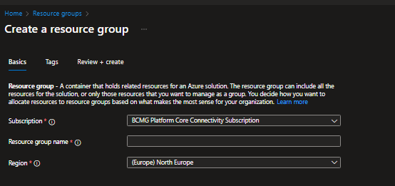

> VS

```hcl
resource "azurerm_resource_group" "example" {
  name     = var.resource_group_name
  location = var.location
}
```

- [create virtual network and subnet](https://learn.microsoft.com/en-us/azure/azure-resource-manager/management/manage-resource-groups-portal#create-resource-groups)

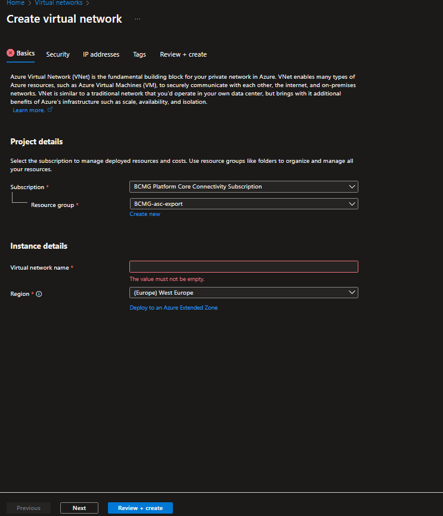
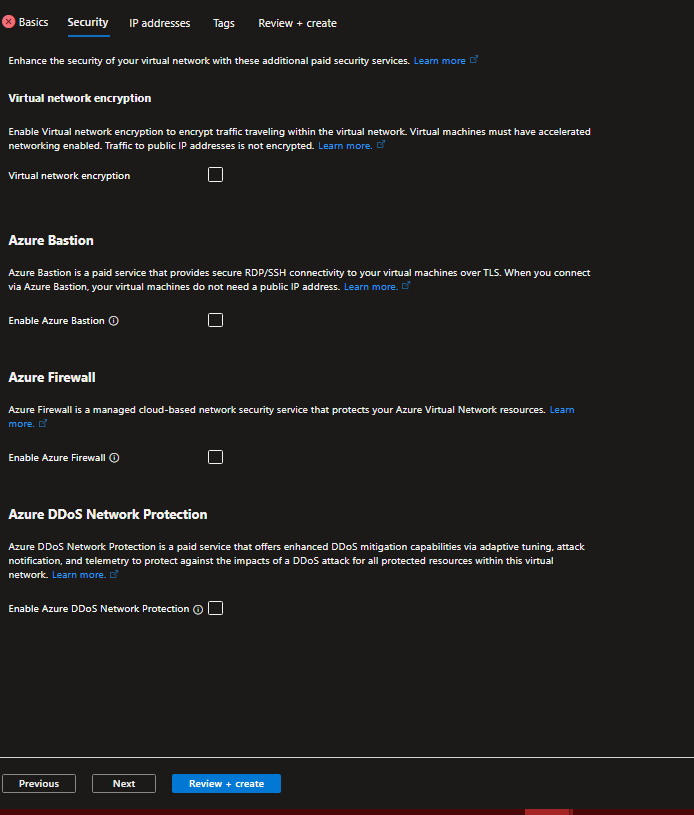
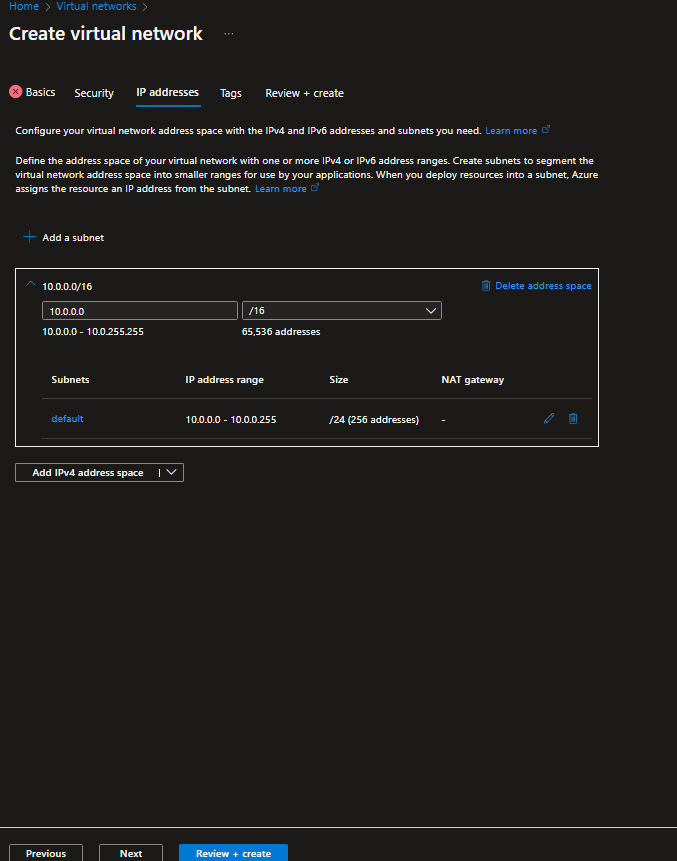

- add subnet

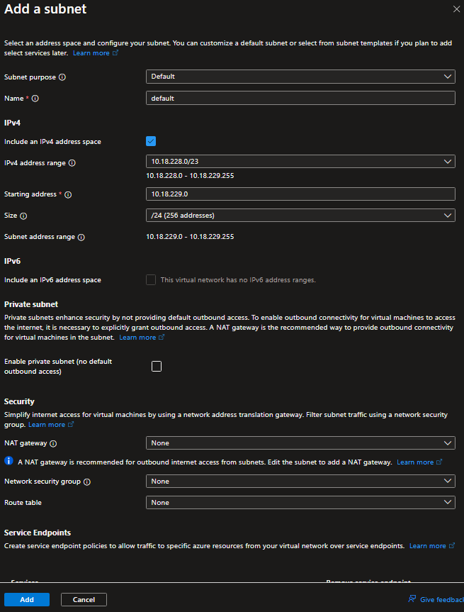

> VS. 

```hcl
resource "azurerm_virtual_network" "example" {
  name                = var.vnet_name
  address_space       = var.vnet_address_space
  location            = azurerm_resource_group.example.location
  resource_group_name = azurerm_resource_group.example.name
}

resource "azurerm_subnet" "example" {
  name                 = var.subnet_name
  resource_group_name  = azurerm_resource_group.example.name
  virtual_network_name = azurerm_virtual_network.example.name
  address_prefixes     = var.subnet_address_prefixes
}
```

- create VM

](image-4.png)
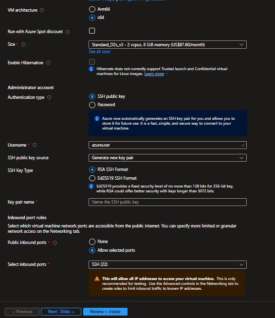

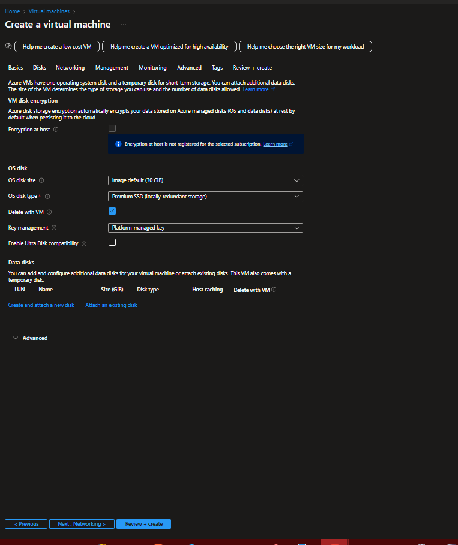

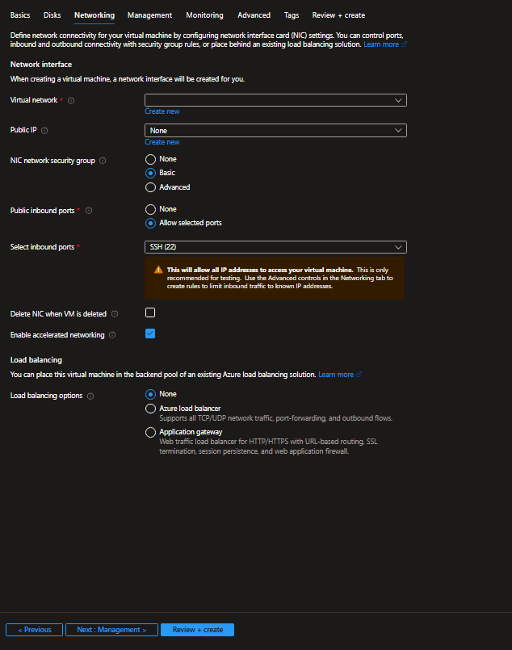

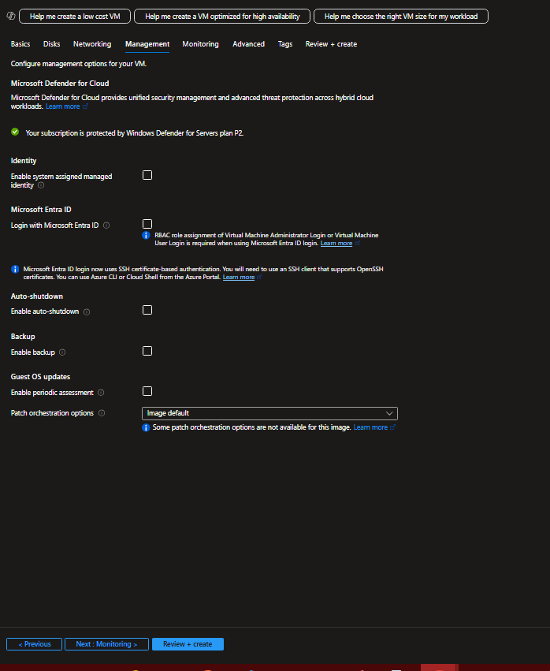

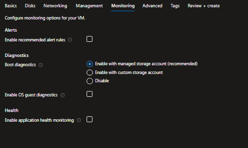

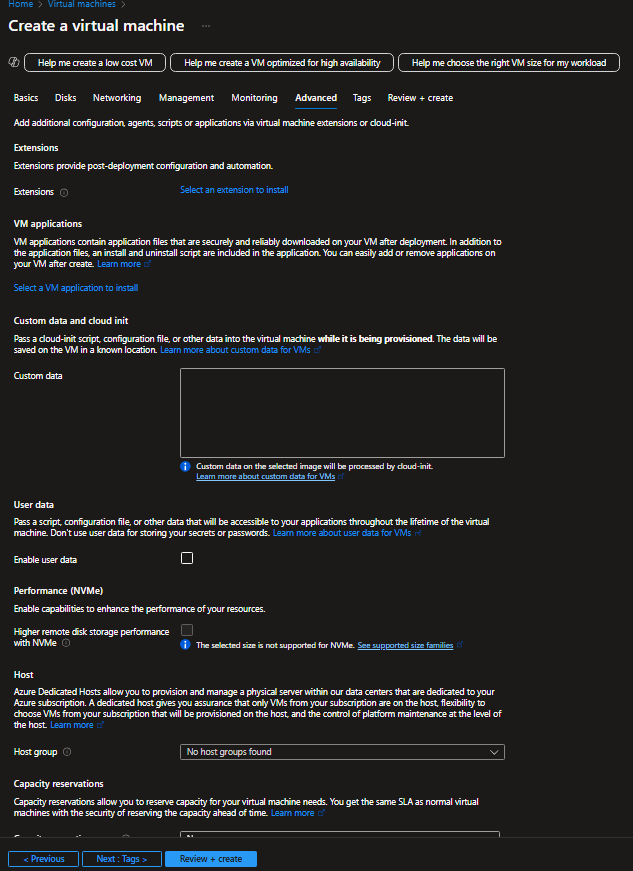

> VS.

```hcl
resource "azurerm_network_interface" "example" {
  name                = var.nic_name
  location            = azurerm_resource_group.example.location
  resource_group_name = azurerm_resource_group.example.name

  ip_configuration {
    name                          = var.subnet_name
    subnet_id                     = azurerm_subnet.example.id
    private_ip_address_allocation = var.private_ip_address_allocation
  }
}

resource "azurerm_linux_virtual_machine" "example" {
  name                = var.vm_name
  resource_group_name = azurerm_resource_group.example.name
  location            = azurerm_resource_group.example.location
  size                = var.vm_size
  admin_username      = var.admin_username
  network_interface_ids = [
    azurerm_network_interface.example.id,
  ]

  admin_ssh_key {
    username   = var.admin_username
    public_key = tls_private_key.ssh_key.public_key_openssh
  }

  os_disk {
    caching              = var.os_disk_caching
    storage_account_type = var.os_disk_storage_account_type
  }

  source_image_reference {
    publisher = var.source_image_publisher
    offer     = var.source_image_offer
    sku       = var.source_image_sku
    version   = var.source_image_version
  }
}
```

## Still not convinced?

Ok, lets picture this very real scenario: 

> we need to create not 1x but 3x VM-s, for our dev, staging and production envs.

- each VM-s should be:
  - in it's own *resource group*
  - in it's own *vnet*
  - in it's own *subnet*
  - with it's own *vnic* in the *subnet*
  - with a *unique name* of course
  - (don't worry about IP, Azure uses dynamic IP by default...phew!!)
  - and they are of different sizes (in a real world we would probably also use different SKU's - OS if you like - but let's not go crazy)
- the rest of their config is similar

So here we have two ways:

### 1. We can click-through the above pages

- fill out each above form **3x times**
- (make sure we select the right values, change what we have to change of course)
- no typos please!
- we can only do one at a time, so build will take a while

> VS.

### 2. We can use terraform

- `cd simple-azure\vms`

- create `main.tf` (I named it `vms_main.tf` for easier distinction)
- as the previous - `vm` - config is now our module, we can just source it with:

```hcl
module "vm_dev" {
  source = "../vm"

  # parameters go here, refer to the module's `variables.tf` for inspiration
}
```

- as we are creating 3x set of resources, we can just copy-paste the above, change a few lines, and we are good to go:

```hcl
module "vm_dev" {
  source = "../vm"

  resource_group_name           = "dev_rg" # Name of the resource group
  location                      = "West Europe"
  vnet_name                     = "dev-network"   # Name of the VNet
  vnet_address_space            = ["10.1.0.0/16"] # Address space of the VNet
  subnet_name                   = "dev-internal"  # Name of the subnet
  subnet_address_prefixes       = ["10.1.2.0/24"] # Address prefix of the subnet
  nic_name                      = "dev-vm-nic"    # Name of the NIC
  private_ip_address_allocation = "Dynamic"
  vm_name                       = "dev-machine"  # Name of the VM
  vm_size                       = "Standard_B1s" # Cheapest general purpose VM size
  admin_username                = "adminuser"
  ssh_key_algorithm             = "RSA"
  ssh_key_rsa_bits              = 4096
  ssh_private_key_path          = "./id_rsa"
  os_disk_caching               = "ReadWrite"
  os_disk_storage_account_type  = "Standard_LRS"
  source_image_publisher        = "Canonical"
  source_image_offer            = "0001-com-ubuntu-server-jammy"
  source_image_sku              = "22_04-lts"
  source_image_version          = "latest"
}

module "vm_stg" {
  source = "../vm"

  resource_group_name           = "stg_rg"
  location                      = "West Europe"
  vnet_name                     = "stg-network"
  vnet_address_space            = ["10.2.0.0/16"]
  subnet_name                   = "stg-internal"
  subnet_address_prefixes       = ["10.2.2.0/24"]
  nic_name                      = "stg-vm-nic"
  private_ip_address_allocation = "Dynamic"
  vm_name                       = "stg-machine"
  vm_size                       = "Standard_B1ls"
  admin_username                = "adminuser"
  ssh_key_algorithm             = "RSA"
  ssh_key_rsa_bits              = 4096
  ssh_private_key_path          = "./id_rsa"
  os_disk_caching               = "ReadWrite"
  os_disk_storage_account_type  = "Standard_LRS"
  source_image_publisher        = "Canonical"
  source_image_offer            = "0001-com-ubuntu-server-jammy"
  source_image_sku              = "22_04-lts"
  source_image_version          = "latest"
}

module "vm_prd" {
  source = "../vm"

  resource_group_name           = "prd_rg"
  location                      = "West Europe"
  vnet_name                     = "prd-network"
  vnet_address_space            = ["10.3.0.0/16"]
  subnet_name                   = "prd-internal"
  subnet_address_prefixes       = ["10.3.2.0/24"]
  nic_name                      = "prd-vm-nic"
  private_ip_address_allocation = "Dynamic"
  vm_name                       = "prd-machine"    # Name of the VM
  vm_size                       = "Standard_A1_v2" # Another cheap VM size option
  admin_username                = "adminuser"
  ssh_key_algorithm             = "RSA"
  ssh_key_rsa_bits              = 4096
  ssh_private_key_path          = "./id_rsa"
  os_disk_caching               = "ReadWrite"
  os_disk_storage_account_type  = "Standard_LRS"
  source_image_publisher        = "Canonical"
  source_image_offer            = "0001-com-ubuntu-server-jammy"
  source_image_sku              = "22_04-lts"
  source_image_version          = "latest"
}
```

- run `terraform init`
- run `terraform plan`
- run `terraform apply`
- run `terraform destroy` to delete all the resources, if no longer needed


### Time and effort

- I have not actually went through the GUI deployment I admit (well, not for this demo for sure)
- but I "gues-timate" is a good engineer (and someone who is less prone to typos than I am!) can nail the creation of 3x resource group, vnet, subnet and VMs in about 45 minutes / `1 hour` or so
- writing the terraform config for this - because we just copy-pasted the above - took me about 5 minutes, running it took about 1 min ...all in, `6 minutes`
- this is about 10x faster than the GUI, with much less room for error

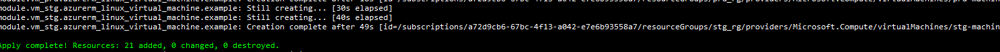

## Ok so *really* not convinced?

Now picture deploying 10x VMs, 100x VMs, 1000x VMs...(or databases, or whatever). What if they should have different sizes, different OSs, different networking, different storage, different security, different everything...? Or ...gasp !... someone says "ok lets change all `Standard_A1_v2` machines to `Standard_B1s`" - how much time would it take to do that?

