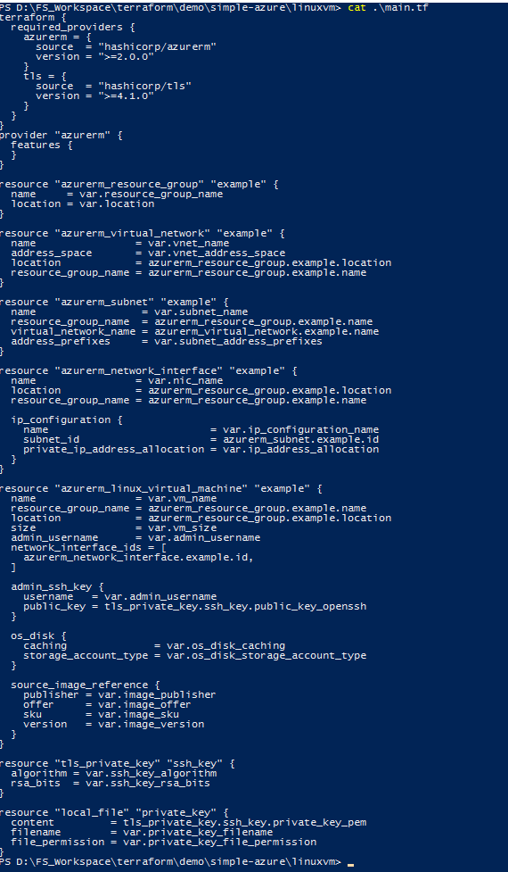

# How to modularise a configuration 
*(and why should we do it?)*

Let's start by answering the question "why" first, and then we will cover the "how" part.

Our starting point will be the [Azure Linux VM resource](https://registry.terraform.io/providers/hashicorp/azurerm/latest/docs/resources/linux_virtual_machine). (The choice of OS matters little, but generally it is easier to work with Linux servers.)

If we take a look on the example provided at that link, we will see how we can relatively easily set up a complete "stack" ( by "stack" I mean the combination `resource group`, `virtual network`, `subnet`, `network interface`, and finally `virtual machine` ). 
This is great, but as soon as we want to create multiple machines, (perhaps in the same resource group, or in another, perhaps in the same VNET or in another, etc.) - we will have to keep repeating a large chunk of the codeblock, and manually edit it, which is not a great practice, source of errors (not to mention it goes against the [D.R.Y. principle of programming](https://en.wikipedia.org/wiki/Don%27t_repeat_yourself)). 
That is, where modules come in.

## Pre-requisites

We will start the writing of the code from scratch, but we still have to have a few things in place:

- [Terraform installed](https://developer.hashicorp.com/terraform/tutorials/aws-get-started/install-cli) on the system (I will not cover this here, feel free to follow the link to do this)
- Terraform often downloads providers and internal modules from [GitHub](https://github.com/) and HashiCorp/Terraform software repositories, so it is a good idea to unlock at least:
  - `*.github.com` 
  - `*.terraform.io`
  - `*.hashicorp.com` 
wildcard domain. Generally port `443` is used, but consider unlocking `80` and `22` too just in case
- we will also need to have an Azure tenant and subscription, and a means to authenticate with these; there are multiple ways to achive this; my recommended way is to use [service principal with a client secret](https://registry.terraform.io/providers/hashicorp/azurerm/latest/docs/guides/service_principal_client_secret), which is both relatively easy to implement and compatible with future-CI/CD implementation, but on the link we can find explanations on other methods as well. (To not make this guide extremely long, I will not detail this here, but in short: Step 1. Create service principal and note down it's client ID and client secret; Step 2. Assign roles as and when needed; start with subscription contributor; might need other roles later)
- if we go with my method, we will need to supply a few environment variables; as I am currently working from a Windows-system, I use PowerShell as my console, and therefore commands will reflect this; Unix-like systems and bash needs slightly different methods, but I leave the reading on this - or AI-ing - down to the reader.

## Create a single Linux VM

### Write code

We will start with with a clean slate in terms of our code.

- we check, if Terraform is properly imported

```powershell
PS D:\FS_Workspace\terraform\demo\simple-azure\linuxvm> terraform version
Terraform v1.11.2
on windows_amd64

Your version of Terraform is out of date! The latest version
is 1.11.3. You can update by downloading from https://www.terraform.io/downloads.html
PS D:\FS_Workspace\terraform\demo\simple-azure\linuxvm>
```

> note: you can see some helpful information about the available commands if you run `terraform --help` or just `terraform` (same results)

- we have no env variables at start, as confirmed by PowerShell

```powershell
PS C:\Users\admin-fsemti> get-childItem Env: | where-object {$_.Name -like "ARM*"}

Name                           Value
----                           -----
ARM_USE_MSI                    true


PS C:\Users\admin-fsemti>
```

- we also start with an empty folder

```powershell
PS D:\FS_Workspace\terraform\demo\simple-azure\linuxvm> get-childitem
PS D:\FS_Workspace\terraform\demo\simple-azure\linuxvm>
```

> note: this is `simple-azure\linuxvm` of this repo

- first of all we need to provide the environment variables, that Terraform use to authenticate for Azure

```powershell
$env:ARM_SUBSCRIPTION_ID = ''   # BCMG-Test-SubscriptionA
$env:ARM_TENANT_ID =''          # BCMGlobal ASI LIMITED
$env:ARM_CLIENT_ID = ''         # terraform-sp clientID
$env:ARM_CLIENT_SECRET = '' # terraform-sp client secret
```

> note: fill out the actual values with your ones

If these filled in correctly, you should be able to check them in your shell:


- now we create a file - `main.tf` to follow convention-  and add the contents from the Linux VM resource (see above)


- as the given example only shows the resources, we need to add the provider details too, this can easily found on the same page


- after this, we should be able to do `terraform init`


- unfortunately, `terraform plan` still leads to an error, but do not panic!


this error is very clear: we do not have the `id_rsa.pub` file in our user's home directory's `.ssh` subfolder :(

to address this, we could use [ssh-keygen](https://learn.microsoft.com/en-us/viva/glint/setup/sftp-ssh-key-gen) or similar tools  to create a key pair, but we probably want to keep this under the control of Terraform; so we update the terraform block, to include a [new provider](https://registry.terraform.io/providers/hashicorp/tls/latest/docs) that will do this for us

```terraform
terraform {
  required_providers {
    azurerm = {
      source  = "hashicorp/azurerm"
      version = ">=2.0.0"
    }
    tls = {
      source  = "hashicorp/tls"
      version = ">=4.1.0"
    }
  }
}
```

and that means we also add some additional resources

```terraform
# Generate SSH key
resource "tls_private_key" "ssh_key" {
  algorithm = "RSA"
  rsa_bits  = 4096
}

# Save private key to local file
resource "local_file" "private_key" {
  content         = tls_private_key.ssh_key.private_key_pem
  filename        = "./id_rsa"
  file_permission = "0600"
}
```

> note: in the interest to keep this guide as short as possible, I will not cover this provider in great details, nor the parameters involved - please read the documentation on the link

we then conveniently use this newly generated SSH key in the VM-s configuration; all we need is to change:

 from:

```terraform

  admin_ssh_key {
    username   = "adminuser"
    public_key = file("~/.ssh/id_rsa.pub")
  }
```

to:

```terraform
  admin_ssh_key {
    username   = "adminuser"
    public_key = tls_private_key.ssh_key.public_key_openssh
  }
```

- after the changes in the code, since we have added a new provider, we need to do a `terraform init` to get that downloaded by Terraform; then a `terraform plan` should work!


...imiting a few lines here ...


the important part is, plan does not fail and shows us the creation of resources;

> note the "7 to add" - this will be important later!

at this point our `main.tf` should look something like this:


> note: I highlighted the parts that changed compared to the example

### Deploy code

At this point in this particular subscription we have no resources


(you can check this on `Azure Portal` --> `All resources` --> filter it to your subscription)

> note: we ignore the network watcher; that is something created by Azure whenever a network interface is created; this subscription had some, and therefore it is present; in a fresh new tenant/sub this should be absent!

to change this:

- run `terraform apply`
- **carefully review** the output to be sure all those are in line with what we want to create


(1) a few resoruces pictured; actual output is longer; advised to go through all of it, or at least glance over it
(2) this is very important; if there are changes, and even more crucially destroys - be cautious before saying `yes` ! 

> note: neither the author or Terraform will be responsible, if you deployed a resource with Terraform, and then did some code change resoulting in unintended changes or destruction!

- after this type `yes` and the deployment will start


deployment can take a few minutes (*depending on a number of factors, i.e. conection to Azure API, load, and the current air humidity at that time in Kiwirrkurra :laughing:*)

- check on Azure what is deployed


> note: while at this time the machine has been deployed, you won't be able to connect to it; that is because if you look at the code, there is not public IP on the network interface; we also did not specify a network security group and NAT gateway - or a bastion service - which would be higly recommended to use in Real World, to provide a secure access to the VM; adding these would make things a lot more complex so we skip this; if you really curious, you can go to the VM on the portal, select "Connect" and Azure will automatically provision a free bastion instance for you, however this is not in the scope of Terraform, nor I am going to explain how to use SSH keys...

- once we done with observing our great work, run `terraform destroy` to de-provision all the resources

## Move to multiple VM-s

Now we are getting to the fun-part. 
Building one VM in a subnet, and one subnet in a vnet, and one vnet in a resource group is hardly what we need, often times we need multiple instances. With individually changing parameters. And that means  we need reusable pieces of code, also called [Terraform modules](https://developer.hashicorp.com/terraform/language/modules).
Now there are modules around the Internet - on the HashiCorp repository and Github mostly - which other people wrote, but we can also create our own.

At this point our folder looks something like this:


The only file we actually created ourselves is the `main.tf` - the rest is all generated by Terraform; I also hid other folders in the repo, in order to not to distract us.

we will create another folder at the same level as `linuxvm`, very creatively named `linuxvms`

```powershell
PS D:\FS_Workspace\terraform\demo\simple-azure\linuxvm> mkdir ..\linuxvms


    Directory: D:\FS_Workspace\terraform\demo\simple-azure


Mode                LastWriteTime         Length Name
----                -------------         ------ ----
d-----       09/05/2025     12:13                linuxvms


PS D:\FS_Workspace\terraform\demo\simple-azure\linuxvm> Get-ChildItem .. -Filter "linux*"


    Directory: D:\FS_Workspace\terraform\demo\simple-azure


Mode                LastWriteTime         Length Name
----                -------------         ------ ----
d-----       09/05/2025     11:58                linuxvm
d-----       09/05/2025     12:13                linuxvms


PS D:\FS_Workspace\terraform\demo\simple-azure\linuxvm>
```

The `linuxvm` folder will contain our module definition, and the `linuxvms` ("S" !!! note it!) will be calling this to create multiple VM-s.

we create a - for now, blank - `main.tf` in that one too


### Structure of modules

Generally speaking the modules in Terraform are comprised of the following files:

- `main.tf` - "mandatory"
- `variables.tf` - "mandatory"
- `outputs.tf` - "optional"

The reason I have put these in quotations, is because technically, you could have a single `allmyterraformcode.tf` file, containing all of these, and Terraform would not care. Other people using your module might!


### Remove hard-coding

Hard-coded values are always bad practice - be it a password in your script connecting to databases, or an unchangable IP address; so we will eliminate these by replacing the potential variables in the `main.tf` with variables in the `variables.tf`.
I show an example for this, explain how it is done, and then I should you the end result - you can edit this on your own time, as the process in-beteen is just "rinse-and-repeat".

Lets take a look at this part of the code:

```terraform
resource "azurerm_network_interface" "example" {
  name                = "example-nic"
  location            = azurerm_resource_group.example.location
  resource_group_name = azurerm_resource_group.example.name

  ip_configuration {
    name                          = "internal"
    subnet_id                     = azurerm_subnet.example.id
    private_ip_address_allocation = "Dynamic"
  }
}
``` 

At this current stage, if we want to create two nic-s, we would need to duplicate this resource, make sure that each of them has a unique name (ie. rename this one from `resource "azurerm_network_interface" "example"` to `resource "azurerm_network_interface" "example_1"` and the copy of the block to `resource "azurerm_network_interface" "example_2"`  ), rename the interface from `example-nic` to `example-nic_1` and `example-nic_2` then rename the IP configuration to `internal_1` and `internal_2` or something similar, then duplicate the VM block, and update  and update `azurerm_network_interface.example.id`, for both new VM block to aligh with the nic-s...this is *way too much work...*

The better way is this:

- create a new variable for the name of the nic in the `variables.tf`

```terraform
variable "nic_name" {
  description = "Name of the Network Interface"
  type        = string
  default     = "example-nic"
}
```
> note: for the structure and all possible parameters of a variable, read [here](https://developer.hashicorp.com/terraform/language/values/variables)


- and reference to it in the interface

```terraform
resource "azurerm_network_interface" "example" {
  name                = var.nic_name
  location            = azurerm_resource_group.example.location
  resource_group_name = azurerm_resource_group.example.name

  ip_configuration {
    name                          = "internal"
    subnet_id                     = azurerm_subnet.example.id
    private_ip_address_allocation = "Dynamic"
  }
}
``` 

- now we do the variables same for the IP configuration

```terraform
variable "ip_configuration_name" {
  description = "Name of the IP configuration"
  type        = string
  default     = "internal"
}

variable "ip_address_allocation" {
  description = "IP address allocation"
  type        = string
  default     = "Dynamic"
}
```

and eventually update the `main.tf` with these variables

```terraform
resource "azurerm_network_interface" "example" {
  name                = var.nic_name
  location            = azurerm_resource_group.example.location
  resource_group_name = azurerm_resource_group.example.name

  ip_configuration {
    name                          = var.ip_configuration_name
    subnet_id                     = azurerm_subnet.example.id
    private_ip_address_allocation = var.ip_address_allocation
  }
}
```

> note: if you run `terraform plan` at this point, there would be virtually no change to the outcome compared to the "Create a single VM" section.

### Now I skip ahead a little

So, like I said, I now skip ahead a bit. Now we know how to create variables for *one resource* - all we have to do is replicate this to *all of the resources* in the `main.tf`

Once you done, you should have `variables.tf` that looks something like this:


*(note the full code, screenshot is partial!)*

And `main.tf` would be something like this:



*(this is actually the entire file)*

If we now run `terraform plan` - the deployment should be working for a single VM.


(you can deploy it with `terraform apply` and then remove it with `terraform destroy` if you like!)

### And then finally, scale this thing!

Right. Now we get to the fun part: scale up.

We will now switch to the `main.tf` in the `linuxvms` folder.


This file is empty at this point. So how do we refer to our module in the `linuxvm` folder?

simply add:

```terraform
terraform {
  required_providers {
    azurerm = {
      source  = "hashicorp/azurerm"
      version = ">=2.0.0"
    }
    tls = {
      source  = "hashicorp/tls"
      version = ">=4.1.0"
    }
  }
}
provider "azurerm" {
  features {
  }
}

module "vm_example_1" {
  source = "../linuxvm"
}
```

We follow this up with the usual `terraform init`, `terraform plan` and `terraform apply`


At this point I hear you say: "That is great Fabrice, but we still built just one VM Fabrice, why we went through all of that trouble..?" - Fair point.

Let's build two VM-s...

Before we can do that though, lets think about one thing: do we really need a separate `resource group` , `virtual network`, `subnet` for each future VM-s? Likely not, so do come changes on the modules:

- REMOVE these from the `linuxvm\main.tf` and add these to `linuxvms\main.tf`

```terraform
resource "azurerm_resource_group" "example" {
  name     = var.resource_group_name
  location = var.location
}

resource "azurerm_virtual_network" "example" {
  name                = var.vnet_name
  address_space       = var.vnet_address_space
  location            = azurerm_resource_group.example.location
  resource_group_name = azurerm_resource_group.example.name
}

resource "azurerm_subnet" "example" {
  name                 = var.subnet_name
  resource_group_name  = azurerm_resource_group.example.name
  virtual_network_name = azurerm_virtual_network.example.name
  address_prefixes     = var.subnet_address_prefixes
}
```

Equally create a new `linuxvms\variables.tf` and COPY these lines from the `linuxvm\variables.tf` to this one too

```terraform
variable "resource_group_name" {
  description = "Name of the resource group"
  type        = string
  default     = "example-resources"
}

variable "location" {
  description = "Azure region where resources will be created"
  type        = string
  default     = "West Europe"
}

variable "vnet_name" {
  description = "Name of the virtual network"
  type        = string
  default     = "example-network"
}

variable "vnet_address_space" {
  description = "Address space for the virtual network"
  type        = list(string)
  default     = ["10.0.0.0/16"]
}

variable "subnet_name" {
  description = "Name of the subnet"
  type        = string
  default     = "internal"
}

variable "subnet_address_prefixes" {
  description = "Address prefixes for the subnet"
  type        = list(string)
  default     = ["10.0.2.0/24"]
}
```

we also create a new variable in `linuxvm\variables.tf`:

```terraform
variable "subnet_id" {
  description = "ID of the subnet"
  type        = string
}
```

Now, these resources are created outside of the module. This introduces some error, if we try to do the dryrun (`terraform plan`) again.


This is because we refer to these resources *inside* the module, but they are no longer *inside* - they been moved *outside* the module.

The solution to this - and the reason that I said *COPY* the variables and not *MOVE* them in this step: we will update the `linuxvm\main.tf` to use variables - for which we will get values from the resources *outside* of the module

```terraform
resource "azurerm_network_interface" "example" {
  name                = var.nic_name
  location            = var.location            # this used to be: azurerm_resource_group.example.location
  resource_group_name = var.resource_group_name # this used to be: azurerm_resource_group.example.name

  ip_configuration {
    name                          = var.ip_configuration_name
    subnet_id                     = var.subnet_id # this used to be: azurerm_subnet.example.id
    private_ip_address_allocation = var.ip_address_allocation
  }
}
```

And then - since we have variables in `linuxvms\variables.tf` too, we can use them in `linuxvms\main.tf` too. So at this point the `main.tf` that calls the module would look like something like this:


(1) provider definition for the module
(2) resources created *outside* of the module, since we need them only once
(3) the actual module call

## From 1 to 2 VM-s

So at this point if we do `terraform plan` we will see the system wants to create 7 resources (just like before).


These are:
- a resource group
- a virtual network
- a subnet
- a network interface
- an ssh key
- a local file for the SSH key
- and a VM

To create additional VM-s with the same module, we need to do two things:

- duplicate the module 
- and make both the module's name, and the reasonably unique variables - by overrwiting the defaults - like so:


With this, now plan is changed:


Wait...2 x 7 should be 14 no..?

True. but remember, we did not create separate resource groups, vnets, and subnets (in fact, if I want to be really lazy, I could have re-used the RSA key too...); what we now want to deploy are:

- a resource group
- a virtual network
- a subnet
- a network interface
- an ssh key 
- a local file for the SSH key
- and a VM
- and a *second* network interface
- and a *second* ssh key 
- and a *second*  local file for the SSH key
- and a *second* VM

(count them: 11 :) )

If you do not believe me:


- 7x resources on Azure


- 2x local files containing the RSA keys
- (the last two items are just the actual rsa keypairs, which I do not have a screenshot of...sorry :()

## Summary

At this point we can:

- scale this infinetly:

All we have to do is duplicate this part of the code; and update the name of the VM, name of the nic and key file name (in order to make them unique), to create additional VMs.

```terraform
module "vm_example_1" {
  source = "../linuxvm"

  resource_group_name = azurerm_resource_group.example.name
  location            = azurerm_resource_group.example.location
  subnet_id           = azurerm_subnet.example.id

  vm_name              = "vm-example-1"
  nic_name             = "nic-example-1"
  private_key_filename = "./id_rsa_example_1"

}
```

Better yet, the modules allow to easily change *all* the variables defined in the module.

For example, the image SKU for the VM can be different between two instances. Currently we esentially have:

```terraform
module "vm_example_1" {
  source = "../linuxvm"

  resource_group_name = azurerm_resource_group.example.name
  location            = azurerm_resource_group.example.location
  subnet_id           = azurerm_subnet.example.id

  vm_name              = "vm-example-1"
  nic_name             = "nic-example-1"
  private_key_filename = "./id_rsa_example_1"

  image_offer = "0001-com-ubuntu-server-jammy"
  image_sku   = "22_04-lts"
}

module "vm_example_2" {
  source = "../linuxvm"

  resource_group_name = azurerm_resource_group.example.name
  location            = azurerm_resource_group.example.location
  subnet_id           = azurerm_subnet.example.id

  vm_name              = "vm-example-2"
  nic_name             = "nic-example-2"
  private_key_filename = "./id_rsa_example_2"

  image_offer = "0001-com-ubuntu-server-jammy"
  image_sku   = "22_04-lts"

}
```

> note: I know. the `image_offer` and `image_sku` parameters are not in the code; instead these are the current default values

But what if we maybe want the second server to be 24?

Simple update this to:


```terraform
module "vm_example_1" {
  source = "../linuxvm"

  resource_group_name = azurerm_resource_group.example.name
  location            = azurerm_resource_group.example.location
  subnet_id           = azurerm_subnet.example.id

  vm_name              = "vm-example-1"
  nic_name             = "nic-example-1"
  private_key_filename = "./id_rsa_example_1"

  image_offer = "0001-com-ubuntu-server-jammy"
  image_sku   = "22_04-lts"
}

module "vm_example_2" {
  source = "../linuxvm"

  resource_group_name = azurerm_resource_group.example.name
  location            = azurerm_resource_group.example.location
  subnet_id           = azurerm_subnet.example.id

  vm_name              = "vm-example-2"
  nic_name             = "nic-example-2"
  private_key_filename = "./id_rsa_example_2"

  image_offer = "ubuntu-24_04-lts"
  image_sku   = "server"
  vm_size     = "Standard_D2s_v3"

}
```

While this will rebuild the VM-s (no other way, as this is a newer OS), you will have at the end:


from one module, two different spec VM

> notes:
> - should you wonder how to find the SKU-s: `az vm image list --publisher ca` will get you the ones published by `Canonical`, `Ubuntu`'s publisher
> - and why did we alter the `vm_size`? other than *because I can*, the answer is: the newer OS required a newer hardwer gen

I realise that this is probably a lot of code. And work. (Even though I must note: this is just a very simple setup, of a less complex resource stacks...)
But the silver lining is:
- most often modules are readily available and you do not have to create them - but it is important to create one at least yourself, so you understand how it works (and troubleshoot)
- after that, if you find one that does what you need...well, ChatGPT or other AIs are your best friend!

## Future plans

- In a later iteration we can make the module call even more user friendly and DRY with the introduction of [local values](https://developer.hashicorp.com/terraform/language/values/locals) and [for_each](https://developer.hashicorp.com/terraform/language/meta-arguments/for_each)
- I did not use `outputs.tf` - at a later stage I will add outputs to the module as well, and we can cover this
