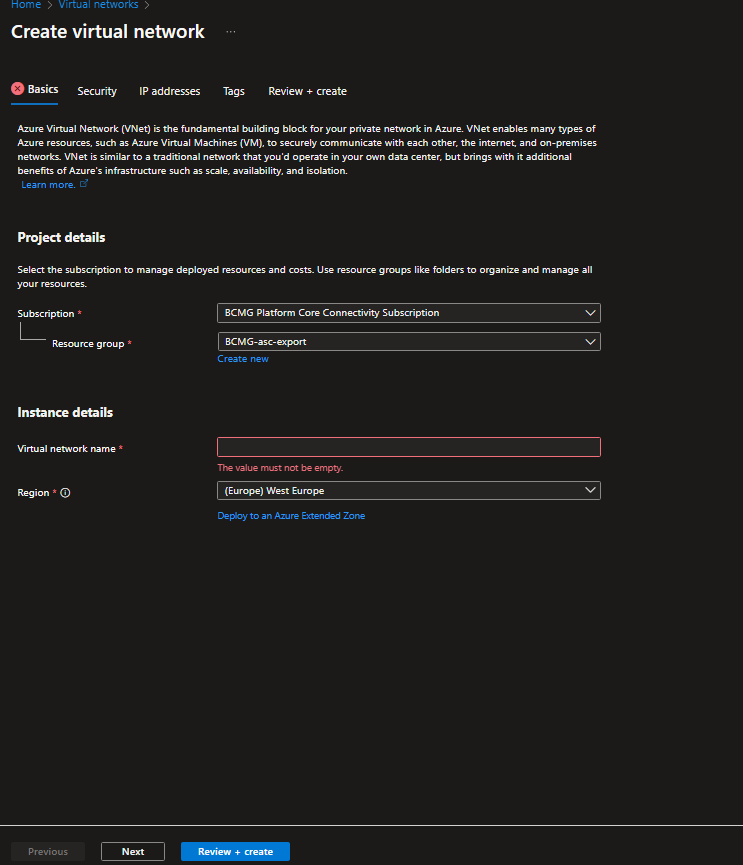
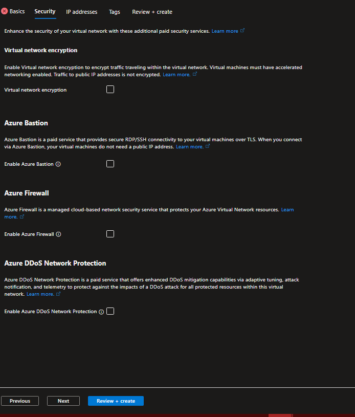
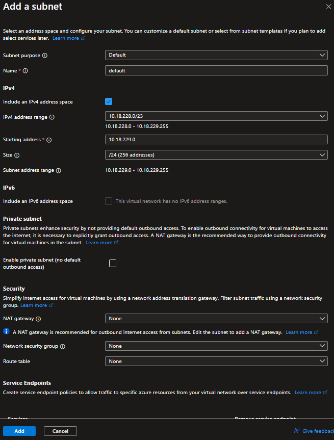
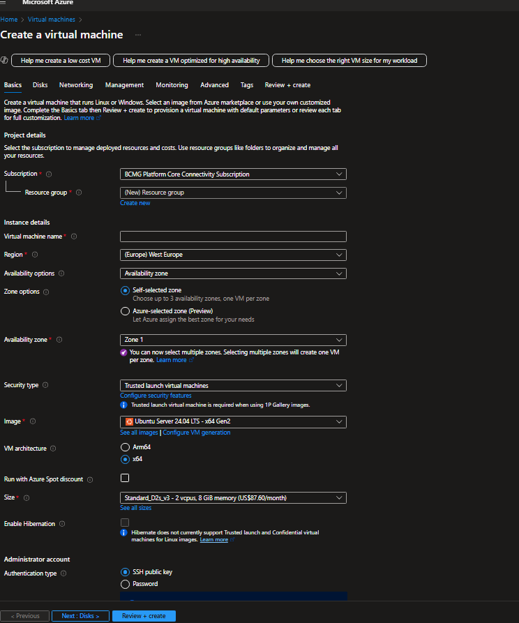
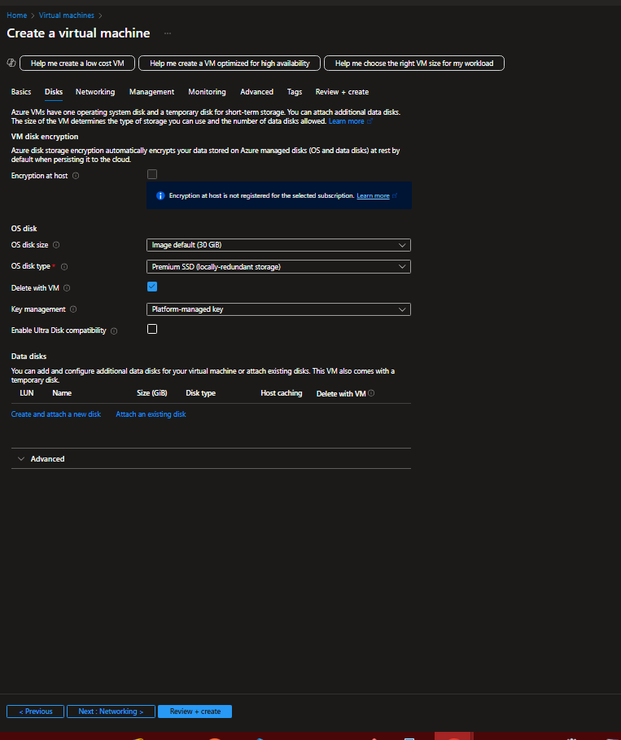
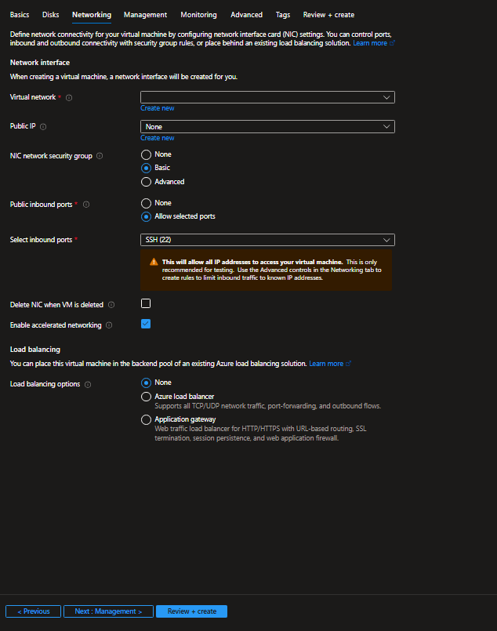
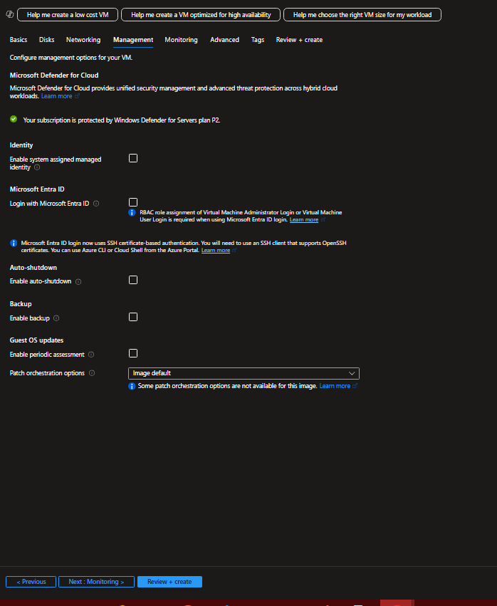
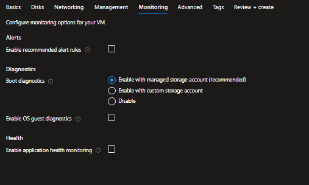
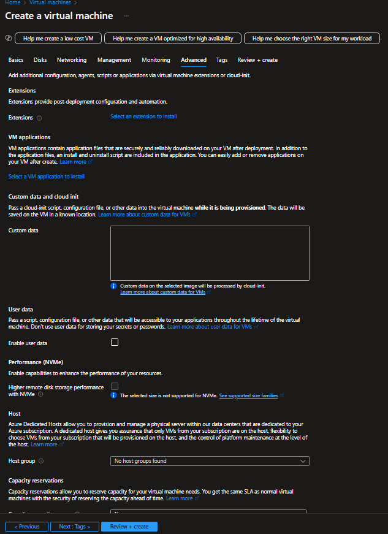

# Notes

## What we create

- an ssh key pair
- an azure resource group
- an azure virtual network
- an azure subnet
- an azyre network interface
- an azure virtual machine

## Terraform-way

- create the neccesary config files (`**main.tf`, `**variables.tf`, `outputs.tf` and `**.tfvars`)
- run `terraform init`
- run `terraform plan`
- run `terraform apply`
- run `terraform destroy` to delete all the resources, if no longer needed

## GUI-way

- create keypair

```sh
## One command
PS /home/admin/.ssh> ssh-keygen     
Generating public/private rsa key pair.
Enter file in which to save the key (/home/admin/.ssh/id_rsa): 
Enter passphrase (empty for no passphrase): 
Enter same passphrase again: 
Your identification has been saved in /home/admin/.ssh/id_rsa
Your public key has been saved in /home/admin/.ssh/id_rsa.pub
The key fingerprint is:
SHA256:XIxnnXF4xiSKIAvrrpJQA2rUFVkE3GBEXWqpqL7s4gc admin@SandboxHost-638785081400030373
The key's randomart image is:
+---[RSA 3072]----+
|  o *O@o..  o+o  |
|.. +.= +o+ o.=+  |
|o.. .  +o * oo   |
|.oo . o. +       |
|...o .  S        |
|.E.              |
|.oo              |
|*. .             |
|**o              |
+----[SHA256]-----+
PS /home/admin/.ssh>

## This is just to check if it is created

PS /home/admin/.ssh> ls -la
total 16
drwx------ 2 admin admin 4096 Mar 25 14:46 .
drwxr-xr-x 9 admin admin 4096 Mar 25 14:20 ..
-rw------- 1 admin admin 2635 Mar 25 14:46 id_rsa
-rw-r--r-- 1 admin admin  590 Mar 25 14:46 id_rsa.pub
PS /home/admin/.ssh> 
```


- [create resource group](https://learn.microsoft.com/en-us/azure/azure-resource-manager/management/manage-resource-groups-portal#create-resource-groups)


> VS

```hcl
resource "azurerm_resource_group" "example" {
  name     = var.resource_group_name
  location = var.location
}
```

- [create virtual network and subnet](https://learn.microsoft.com/en-us/azure/azure-resource-manager/management/manage-resource-groups-portal#create-resource-groups)





- add subnet



> VS. 

```hcl
resource "azurerm_virtual_network" "example" {
  name                = var.vnet_name
  address_space       = var.vnet_address_space
  location            = azurerm_resource_group.example.location
  resource_group_name = azurerm_resource_group.example.name
}

resource "azurerm_subnet" "example" {
  name                 = var.subnet_name
  resource_group_name  = azurerm_resource_group.example.name
  virtual_network_name = azurerm_virtual_network.example.name
  address_prefixes     = var.subnet_address_prefixes
}
```

- create VM

](image-4.png)












> VS.

```hcl
resource "azurerm_network_interface" "example" {
  name                = var.nic_name
  location            = azurerm_resource_group.example.location
  resource_group_name = azurerm_resource_group.example.name

  ip_configuration {
    name                          = var.subnet_name
    subnet_id                     = azurerm_subnet.example.id
    private_ip_address_allocation = var.private_ip_address_allocation
  }
}

resource "azurerm_linux_virtual_machine" "example" {
  name                = var.vm_name
  resource_group_name = azurerm_resource_group.example.name
  location            = azurerm_resource_group.example.location
  size                = var.vm_size
  admin_username      = var.admin_username
  network_interface_ids = [
    azurerm_network_interface.example.id,
  ]

  admin_ssh_key {
    username   = var.admin_username
    public_key = tls_private_key.ssh_key.public_key_openssh
  }

  os_disk {
    caching              = var.os_disk_caching
    storage_account_type = var.os_disk_storage_account_type
  }

  source_image_reference {
    publisher = var.source_image_publisher
    offer     = var.source_image_offer
    sku       = var.source_image_sku
    version   = var.source_image_version
  }
}
```

## Still not convinced?

Ok, lets picture theis very real scenario: we need to create not 1x but 3x VM-s, for our dev, staging and production envs.
- each VM-s should be:
  - in it's own resource group
  - in it's own vnet
  - in it's own subnet
  - with it's own nic
  - with unique name
  - (don't worry about IP, we let you to use dhcp)
  - and they are of different sizes
- the rest of their config is similar

So here we have two ways:

### 1. We can click-through the above pages

- fill out each 3x times
- make sure we select the right values, change what we have to
- no typos please!
- we can only do one at a time

> VS.

### 2. We can use terraform

At this point the original config ...


...becomes a module (in a differnt folder; in this case ..\vms) that we call again and again ...

```hcl
module "vm1" {
  source = "../vm"
  ...
```

> `..\vm` means we go one folder above and use `vm` folder

...and call it 3x times with 3x slightly different config each time

```hcl
module "vm_dev" {
  source = "../vm"

  resource_group_name           = "dev_rg" # Name of the resource group
  location                      = "West Europe"
  vnet_name                     = "dev-network"   # Name of the VNet
  vnet_address_space            = ["10.1.0.0/16"] # Address space of the VNet
  subnet_name                   = "dev-internal"  # Name of the subnet
  subnet_address_prefixes       = ["10.1.2.0/24"] # Address prefix of the subnet
  nic_name                      = "dev-vm-nic"    # Name of the NIC
  private_ip_address_allocation = "Dynamic"
  vm_name                       = "dev-machine"  # Name of the VM
  vm_size                       = "Standard_B1s" # Cheapest general purpose VM size
  admin_username                = "adminuser"
  ssh_key_algorithm             = "RSA"
  ssh_key_rsa_bits              = 4096
  ssh_private_key_path          = "./id_rsa"
  os_disk_caching               = "ReadWrite"
  os_disk_storage_account_type  = "Standard_LRS"
  source_image_publisher        = "Canonical"
  source_image_offer            = "0001-com-ubuntu-server-jammy"
  source_image_sku              = "22_04-lts"
  source_image_version          = "latest"
}

module "vm_stg" {
  source = "../vm"

  resource_group_name           = "stg_rg"
  location                      = "West Europe"
  vnet_name                     = "stg-network"
  vnet_address_space            = ["10.2.0.0/16"]
  subnet_name                   = "stg-internal"
  subnet_address_prefixes       = ["10.2.2.0/24"]
  nic_name                      = "stg-vm-nic"
  private_ip_address_allocation = "Dynamic"
  vm_name                       = "stg-machine"
  vm_size                       = "Standard_B1ls"
  admin_username                = "adminuser"
  ssh_key_algorithm             = "RSA"
  ssh_key_rsa_bits              = 4096
  ssh_private_key_path          = "./id_rsa"
  os_disk_caching               = "ReadWrite"
  os_disk_storage_account_type  = "Standard_LRS"
  source_image_publisher        = "Canonical"
  source_image_offer            = "0001-com-ubuntu-server-jammy"
  source_image_sku              = "22_04-lts"
  source_image_version          = "latest"
}

module "vm_prd" {
  source = "../vm"

  resource_group_name           = "prd_rg"
  location                      = "West Europe"
  vnet_name                     = "prd-network"
  vnet_address_space            = ["10.3.0.0/16"]
  subnet_name                   = "prd-internal"
  subnet_address_prefixes       = ["10.3.2.0/24"]
  nic_name                      = "prd-vm-nic"
  private_ip_address_allocation = "Dynamic"
  vm_name                       = "prd-machine"    # Name of the VM
  vm_size                       = "Standard_A1_v2" # Another cheap VM size option
  admin_username                = "adminuser"
  ssh_key_algorithm             = "RSA"
  ssh_key_rsa_bits              = 4096
  ssh_private_key_path          = "./id_rsa"
  os_disk_caching               = "ReadWrite"
  os_disk_storage_account_type  = "Standard_LRS"
  source_image_publisher        = "Canonical"
  source_image_offer            = "0001-com-ubuntu-server-jammy"
  source_image_sku              = "22_04-lts"
  source_image_version          = "latest"
}

```

### Time and effort

- I have not actually went through the GUI deployment
- but I "guestimate" a good engineer (and someone who is less prone to typos than I am!) can nail the creation of 3x resource group, vnet, subnet and VMs in about 45 minutes - an hour or so
- writing the terraform config for this - because we just copy-pasted the above - took me about 5 minutes, add in 1 min of deployment runtime 
- this is about 10x faster than the GUI, with much less room for error


## Ok so really not convinced?

Now picture deploying 10x VMs, 100x VMs, 1000x VMs...(or databases, or whatever)